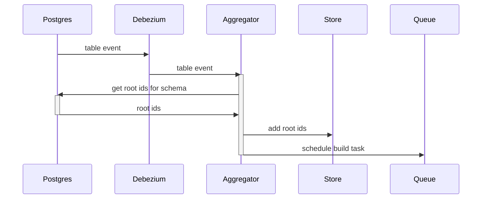
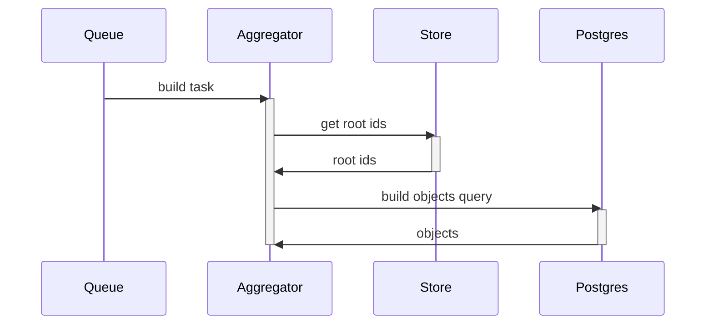

# How does it work?

At its core, PG-Capture is pretty simple, but having a good understanding of how the aggregator works will help you use it more effectively. The process can be split into two parts: the low-level event aggregation and the high-level event building / emitting. 

## Aggregation
The aggregation part looks like this:


In this example we chose [Debezium](https://debezium.io/) to catch the events, but you can use any other tool that can catch WAL events from Postgres and forward them to the aggregator.

The root ids are simply the ids of the root table of the schema. Lets consider a simple usecase where we are interested in books and their authors. The schema would look like this:
```typescript
import { RootSchema } from 'pg-capture';

const schema: RootSchema = {
  table: 'book',
  primaryKey: 'id',
  schema: {
    type: 'object',
    properties: {
      id: {
        type: 'column',
        column: 'id',
      },
      title: {
        type: 'column',
        column: 'title',
      },
      author: {
        type: 'many-to-one',
        column: 'authorId',
        referencesTable: 'author',
        referencesColumn: 'id',
        hasFKConstraint: true,
        schema: {
          type: 'column',
          column: 'name',
        },
      },
    },
  },
};
```
Given this schema, when the aggregator receives a table event, it tries to determine if the event might impact the schema. In our example, all events to the tables `book` or `author` might impact the schema, and events to other tables will be ignored.

If the table event is on the `author` table, the aggregator has to query Postgres to find all root ids of books that reference that author and add them to the store.

Finally, the aggregator schedules a build task to build the objects from the root ids. Here we used a queue (eg. [RabbitMQ](https://www.rabbitmq.com/)) but PG-Capture lets you use any other mechanism to schedule the build task.

## Building and emitting



The second part is very straight forward. The aggregator retrieves the root ids from the store and builds the objects from the root ids. The objects are then emitted as a high level event.

## Step by step inner workings

Let's start by creating an aggregator:

```typescript
import { RootSchema, EventAggregator, Changes } from 'pg-capture';
import { Client } from 'pg';

const client = new Client(/*...*/) // A read-only PG client

const schema: RootSchema = {/*...*/};

const aggregator = new EventAggregator({
  schema,
  client,
  onChange: (changes: Changes) => console.log(changes)
})
```

### 1. `handleEvent` is called with a low level event
It is your job to call the `handleEvent` method with all the low level events that happen on your tables. Usually you will use something like [Debezium](https://debezium.io/) or [wal-listener](https://github.com/ihippik/wal-listener) to catch the event, and forward them to the aggregator:

```typescript
await aggregator.handleEvent({
  action: 'UPDATE',
  table: 'author',
  data: {
    id: 'foo',
    name: 'Alice',
  },
  dataOld: {
    id: 'foo',
    name: 'Bob',
  },
})
```

Since PG-Capture is agnostic of the source of the events, it is your job to format the events in a way that PG-Capture can understand. Check the [Events](events) page for more information.

### 2. The list of root ids is fetched
The `handleEvent` method tries to determine if the event might impact the schema, and tries to find the id of the root table (ie. the books table).

Here, if we update a book, it will simply use the id of said book, and if we update an author it will use the id of the author to find the books that reference that author.

Under the hood, it uses the `getRootIdsFromEvent` function. For an event on the book table we would have:

```typescript
import { getRootIdsFromEvent } from 'pg-captur';

const { ids, query } = getRootIdsFromEvent(schema, {
  action: 'INSERT',
  table: 'book',
  data: {
    id: 'foo',
    title: 'Harry Potter',
  },
  dataOld: undefined,
});

console.log(ids); // ['foo']
console.log(query); // null
```

For an event on the authors table we would have:

```typescript
const { ids, query } = getRootIdsFromEvent(schema, {
  action: 'UPDATE',
  table: 'author',
  data: {
    id: 'bar',
    name: 'Alice',
  },
  dataOld: {
    id: 'bar',
    name: 'Bob',
  },
});

console.log(ids); // []
console.log(query); // QueryBuilder
```

With a `query` that would be:

```sql
SELECT "book_1"."id" as "id" 
FROM "book" as "book_1"  
WHERE "book_1"."authorId" = $1 
GROUP BY "book_1"."id"
```

Notice that for some events, no query need to be run (like when inserting a row in the book table)

### 3. The ids are aggregated in a store
The `handleEvent` method then adds those root ids to a set. By default, this set is in memory, but you can use Redis, or implement your own store. This step allows you to aggregate multiple low level events that may impact the same root object into a single high level event.

```typescript
import { RedisSet } from 'pg-capture';
import { Redis } from 'ioredis';

const redis = new Redis();

const aggregator = new EventAggregator({
  schema,
  client,
  idsSet: new RedisSet({ 
    client: redis,
    key: 'my-redis-key'
  }),
})
```

Alternatively you can implement your own `IdsSet` class:

```typescript
import type { IdsSet } from 'pg-capture';

export class MySet implements IdsSet {
  private set = new Set();
  
  async add(ids: unknown[]) {
    ids.forEach(id => this.set.add(id));
  }

  async delete(ids: unknown[]) {
    ids.forEach(id => this.set.delete(id));
  }

  async *getAll() {
    yield [...this.set]
  }
}

```
We recommend using a store like Redis rather than using the default in-memory store to aggregate events across multiple instances.

### 4. The build task is scheduled
The build task simply retrieves all the root ids from the store and builds the corresponding objects.

By default, the build task is called immediately, but you can schedule it to run later to avoid rebuilding the same object too many times, and to batch multiple objects in a single SQL query. This is useful when multiple tables are updated simultaneously in a transaction for instance.

```typescript
const aggregator = new EventAggregator({
  schema,
  client,
  scheduleBuildObjects: (build) => {
    setTimeout(() => {
      build();
    }, 100); // Call the build task 100ms after the event
  }
})
```

In reality this is not really practical to do everything on the same instance. A common approach is rather to push a message to a queue with a small delay:

```typescript
const aggregator = new EventAggregator({
  schema,
  client,
  scheduleBuildObjects: () => {
    channel.sendToQueue(
      'my-queue', 
      Buffer.from('Build objects'), // Arbitrary message
      { delay: 100 }, // A small delay to allow for batching
    );
  }
})
```

Notice that in this last example, the `build` callback is not called. This means that you need to listen to that queue and trigger the next step yourself to build your objects.

### 5. The objects are built
By default, the `buildObjects` method of the aggregator is called automatically. But if your `scheduleBuildObjects` function does not call the `build` callback, you have to call it manually:

```typescript
const aggregatorEmitter = new EventAggregator({
  schema,
  client,
  idsSet: new RedisSet({
    client: redis,
    key: 'my-redis-key'
  }),
  scheduleBuildObjects: () => {
    // Schedule the build task by pushing a message to a queue
    channel.sendToQueue('my-queue', Buffer.from('Build objects'));
  }
});

// Handle the low level events by calling the handleEvent method
await aggregatorEmitter.handleEvent(event);

// ---------------- In another process

// Create an aggregator with the same schema
const aggregatorBuilder = new EventAggregator({
  schema,
  client,
  idsSet: new RedisSet({
    client: redis,
    key: 'my-redis-key'
  }),
  onChange: (changes) => {
    // Handle the high level event
  }
});

// Consume the queue
channel.consume('my-queue', async (msg) => {
  // Call buildObjects manually
  await aggregatorBuilder.buildObjects();
  channel.ack(msg);
});
```

Notice that we created two instances of `EventAggregator` in two separate threads (possibly two different workers). The important thing to note is that the same schema is used and both `RedisSet` use the same key.

The first instance is used to handle the low level events and schedule build tasks, and the second instance is used to execute the build tasks and emit events. This is a common pattern when you want to scale the building of objects across multiple instances.

Under the hood, the `buildObjects` method retrieves the list of root ids for the set and calls the `buildSchemaQuery` function:

```typescript
import { buildSchemaQuery } from 'pg-capture';

for await (const ids of idsSet.getAll()) {
  const query = buildSchemaQuery(schema, ids);
}
```
The generated queries will look like this given our schema:
```sql
SELECT 
  "book_1"."id" AS "id", 
  JSON_BUILD_OBJECT(
    'id', "book_1"."id", 
    'title', "book_1"."title", 
    'author', "author_2"."object"
  ) AS "object" 
FROM "book" AS "book_1" 
LEFT JOIN (
  SELECT 
    "author_1"."id" AS "id", 
    "author_1"."name" AS "object" 
  FROM "author" AS "author_1"
) AS "author_2" ON "book_1"."authorId" = "author_2"."id" 
WHERE "book_1"."id" IN ($1, $2, $3)
```

If the query returns a result for a given id, then the object was upserted. If the query returns no result, then the object was deleted.

### 6. The high level event is emitted

The `buildObjects` method then build the `Changes` object with the list of upserted and deleted objects and emits the high level event. This is done by calling the `onChange` callback that was passed to the aggregator.

It is up to you to then publish a message to a queue or to do work immediately.
